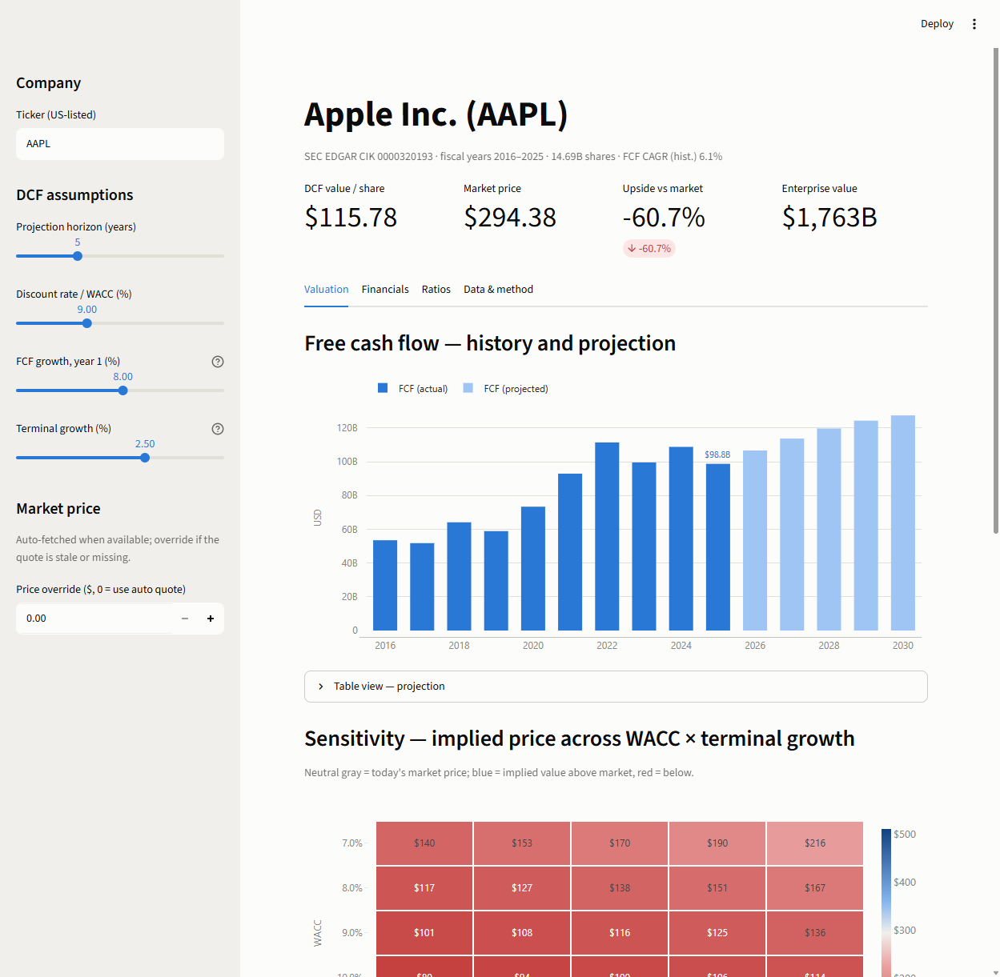
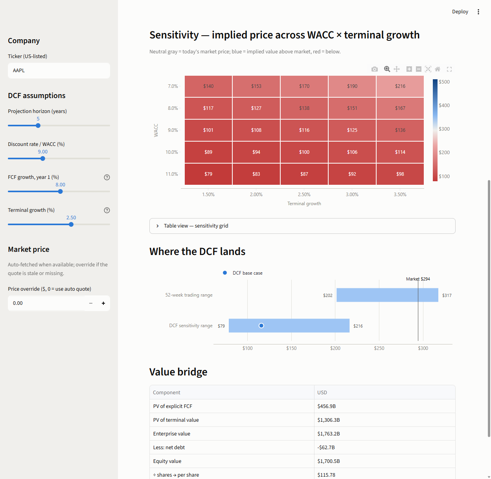
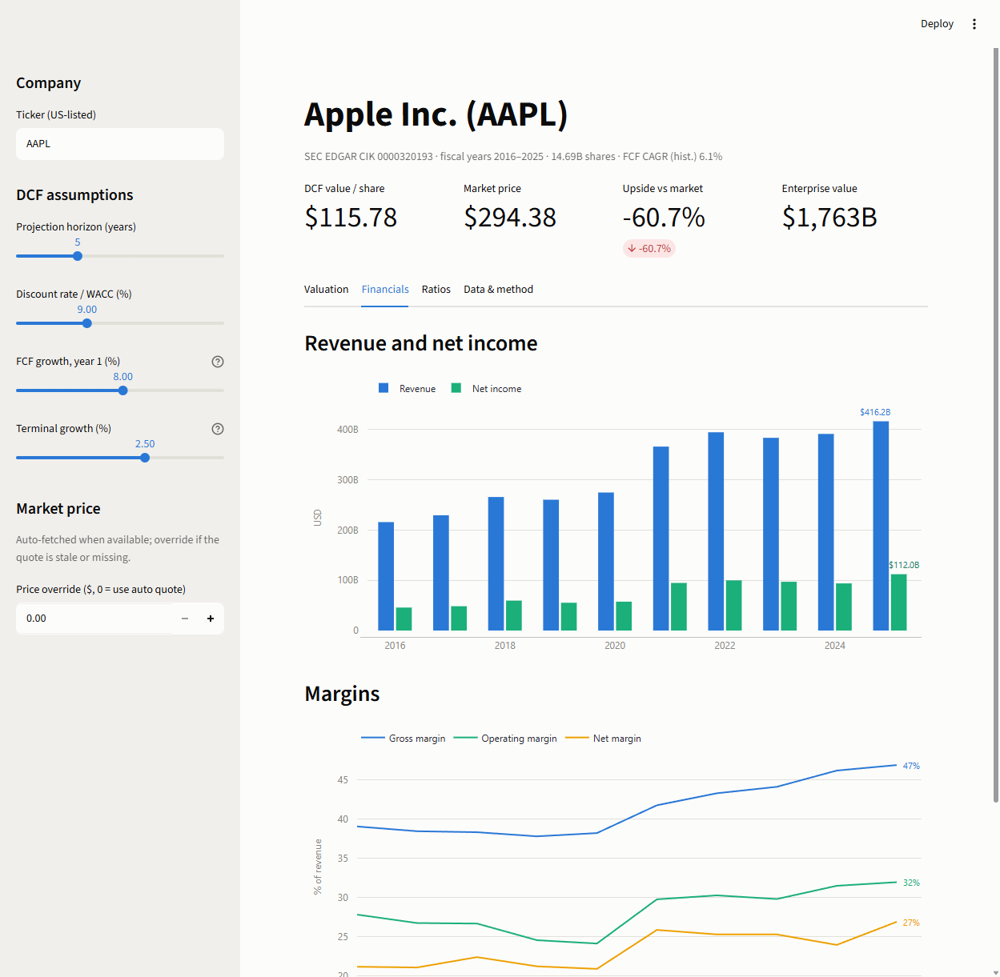

# 📊 Equity DCF — from 10-K to Value

Type a ticker; get a valuation. The app pulls a company's **audited 10-K history
straight from SEC EDGAR** (no API key, no manual inputs), builds the ratio picture,
and runs an interactive **discounted cash flow** — your assumptions, live sensitivity,
implied value per share against the market price.

The pitch in one line: *read the 10-K, then write the Python to analyze it.*

**Stack:** Python · pandas · Plotly · Streamlit · SEC EDGAR XBRL API
**Data:** [SEC EDGAR `companyfacts`](https://www.sec.gov/edgar/sec-api-documentation) — every
number traces to a filed 10-K. Market quote (comparison only) via Yahoo Finance, with a
manual override.



---

## What it does

1. **Ticker → CIK → facts.** Resolves any US-listed ticker through the SEC's company
   list and pulls its full XBRL filing history.
2. **Cleans the way EDGAR actually is**, not the way tutorials pretend it is:
   - `form=10-K, fp=FY` still contains *quarterly* facts — annual flows are filtered
     by a 330–400-day duration window.
   - Tag coverage drifts (Apple's `Revenues` stops in FY2018) — each metric has a
     fallback chain, merged per fiscal year.
   - Debt tags vary by filer (Coca-Cola switched to `LongTermDebtAndCapitalLeaseObligations`
     in FY2024) — composite-first chains prevent both gaps and double-counting.
3. **DCF with explicit, adjustable assumptions.** FCF (CFO − capex) projected with
   growth fading linearly to the terminal rate, Gordon-growth terminal value, net-debt
   bridge, per-share result.
4. **Sensitivity, not a point estimate.** A WACC × terminal-growth grid, colored as a
   diverging scale anchored at the market price — neutral gray *is* today's price, blue
   is implied upside, red is implied downside.



## Chart & UI conventions

Deliberately boring, deliberately consistent:

- One y-axis per chart — never dual scales.
- Fixed categorical color slots; a series never changes hue when the view changes.
- Diverging color only where there's a true midpoint (market price); sequential
  one-hue ramps for magnitude; thin marks, hairline grids, selective direct labels.
- Every chart ships with a **table view** twin and hover tooltips — values are never
  color-alone.



## Quick start

```bash
pip install -r requirements.txt
streamlit run app.py
```

Try `AAPL`, `MSFT`, `KO`, `NVDA`. Banks and insurers (e.g. `JPM`) are rejected with an
explanation — their filings don't carry the revenue/CFO/capex shape a FCF-based DCF needs.

## Method and limitations (honest version)

- **FCF = CFO − capex** — a levered proxy, not a full NOPAT/unlevered build.
- **Net debt = total debt − cash**; leases and short-term investments are excluded.
- **WACC is a user assumption**, not derived from beta or capital structure.
- Shares outstanding are the latest cover-page count (includes post-FY buybacks).
- A default-assumption DCF will happily tell you a quality compounder is "overvalued" —
  that's the model being honest about what growth is priced in, and why the sensitivity
  grid matters more than any single number.
- **Not investment advice.** A transparent, reproducible teaching model.

## Project layout

| File | Role |
|------|------|
| `edgar.py` | EDGAR client: ticker→CIK, companyfacts, annual-fact extraction |
| `dcf.py` | DCF engine: projection, terminal value, equity bridge, sensitivity |
| `quotes.py` | Best-effort market quote (never load-bearing) |
| `charts.py` | Plotly figure builders (all charting conventions live here) |
| `app.py` | Streamlit dashboard |
